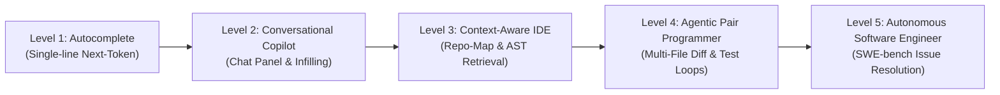
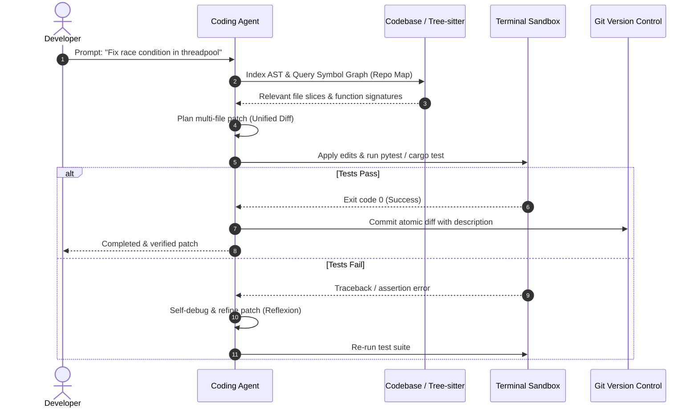

# Awesome AI Coding Tools [](https://awesome.re) [](CONTRIBUTING.md) [](https://opensource.org/licenses/MIT)

> A curated collection of state-of-the-art AI coding assistants, terminal agents, autonomous software engineering architectures, local code foundation models, and foundational research papers bridging academia and industry.

---

## 📑 Contents

- [Architectural Paradigm](#-architectural-paradigm)
- [Agentic IDEs & Editors](#-agentic-ides--editors)
- [Terminal & CLI Coding Agents](#-terminal--cli-coding-agents)
- [Open-Source Copilots & Extensions](#-open-source-copilots--extensions)
- [Autonomous Software Engineers](#-autonomous-software-engineers)
- [Local & Open-Weight Coding Models](#-local--open-weight-coding-models)
- [Automated Code Review & Security](#-automated-code-review--security)
- [Automated Testing & QA](#-automated-testing--qa)
- [Architecture & Documentation Generators](#-architecture--documentation-generators)
- [Foundational Papers & Benchmarks](#-foundational-papers--benchmarks)
- [Under the Hood: How Coding Agents Work](#-under-the-hood-how-coding-agents-work)
- [Local Offline Developer Recipe](#-local-offline-developer-recipe)
- [Comprehensive Feature Matrix](#-comprehensive-feature-matrix)
- [Contributing](#-contributing)

---

## 🏗 Architectural Paradigm

The evolution of AI coding tools has shifted from single-token completion to multi-turn agentic feedback loops that execute, test, and self-heal code:



### The Autonomous Agent Execution Loop

Modern tools (such as Aider, Cursor Composer, and SWE-agent) employ closed-loop test execution rather than passive text generation:



---

## 💻 Agentic IDEs & Editors

Full-featured development environments built natively around agentic pair programming and multi-file code editing.

- [Cursor](https://www.cursor.com/) — AI-native fork of VS Code featuring instant codebase indexing, multi-file edits (Composer), semantic search, and terminal error fixing.
- [Windsurf](https://codeium.com/windsurf) — Next-generation agentic IDE by Codeium featuring "Flows" that track real-time developer context and synchronized multi-step edits.
- [Zed](https://zed.dev/) — High-performance, GPU-accelerated code editor written in Rust with deep model integration and concurrent assistant panels.
- [PearAI](https://trypear.ai/) — Open-source alternative to Cursor built on VS Code with transparent model routing and customizable backends.

---

## ⚡ Terminal & CLI Coding Agents

Command-line power tools that operate directly inside your terminal, managing git commits and automated terminal feedback.

- [Aider](https://github.com/paul-gauthier/aider) — Command-line AI pair programmer that parses your repository into a Tree-sitter map, edits multiple files, runs lint/test commands, and automatically commits atomic git diffs.
- [Claude Code](https://docs.anthropic.com/en/docs/agents-and-tools/claude-code/overview) — High-agency CLI research tool capable of navigating large code repositories, running shell commands, and managing complex multi-file refactors.
- [Cline](https://github.com/cline/cline) — Autonomous coding agent extension for VS Code that executes terminal commands, inspects local browser previews, and requests human-in-the-loop permission.
- [Mentat](https://github.com/AbanteAI/mentat) — Open-source AI tool capable of coordinating complex git workflows directly in the terminal with repo-wide context.

---

## 🔌 Open-Source Copilots & Extensions

Pluggable extensions compatible with standard editors (VS Code, Neovim, JetBrains) allowing custom local and remote model backends.

- [Continue.dev](https://github.com/continuedev/continue) — The leading open-source AI code assistant for VS Code and JetBrains; supports local models (Ollama, LM Studio) and cloud APIs with custom slash commands.
- [Avante.nvim](https://github.com/yetone/avante.nvim) — Neovim plugin designed to emulate Cursor AI's multi-file editing capabilities natively in Lua.
- [Codeium](https://codeium.com/) — Free AI code completion and chat extension for 40+ IDEs with enterprise self-hosting options.
- [Tabby](https://github.com/TabbyML/tabby) — Self-hosted AI coding assistant server; an open-source alternative to GitHub Copilot with full data privacy.

---

## 🤖 Autonomous Software Engineers

Full-loop autonomous agents that triage GitHub issues, implement features, and run verification test suites independently.

- [OpenHands (formerly OpenDevin)](https://github.com/All-Hands-AI/OpenHands) — Autonomous software development agent capable of writing code, browsing the web, and running dockerized environments.
- [SWE-agent](https://github.com/princeton-nlp/SWE-agent) — Open-source agent developed by Princeton that resolves real GitHub issues on the SWE-bench benchmark using an Agent-Computer Interface (ACI).
- [Devika](https://github.com/stitionai/devika) — Agentic open-source software engineer capable of breaking down user goals into multi-stage tasks and executing web research.

---

## 🧠 Local & Open-Weight Coding Models

Top-tier open weights you can run locally or deploy on private infrastructure to keep proprietary code completely private.

- [Qwen2.5-Coder](https://github.com/QwenLM/Qwen2.5-Coder) — Leading open-source coding foundation model series (0.5B to 32B) competitive with leading closed models across code generation, completion, and multi-file reasoning.
- [DeepSeek-Coder-V2](https://github.com/deepseek-ai/DeepSeek-Coder-V2) — Mixture-of-Experts code language model with 128k context length supporting 338 programming languages.
- [StarCoder 2](https://github.com/bigcode-project/starcoder2) — Open, transparently trained code models (3B, 7B, 15B) curated by BigCode under permissive licenses.
- [Codestral](https://mistral.ai/news/codestral/) — Mistral AI’s open-weight model specialized in code completion and fill-in-the-middle tasks with an 80-language vocabulary.

---

## 🛡️ Automated Code Review & Security

Review bots that inspect pull requests, catch subtle concurrency bugs, and enforce architectural guidelines.

- [CodeRabbit](https://coderabbit.ai/) — AI-driven pull request reviewer providing line-by-line feedback, sequence diagrams, and security vulnerability checks.
- [Qodo (CodiumAI)](https://www.qodo.ai/) — Comprehensive code integrity platform analyzing PRs, writing regression tests, and enforcing code standards.
- [Semgrep Assistant](https://semgrep.dev/) — Combines deterministic static analysis (AST rules) with LLM explanations to eliminate false-positive security findings.

---

## 🧪 Automated Testing & QA

Tools that automatically write edge cases, integration tests, and unit tests to push test coverage up to 90%+.

- [Cover-Agent](https://github.com/Codium-ai/cover-agent) — Open-source generative testing tool that iteratively generates unit tests until target coverage is met.
- [Keploy](https://github.com/keploy/keploy) — Open-source zero-code test generator that captures real network calls and creates automated regression test suites.
- [Mutmut](https://github.com/boxed/mutmut) — Python mutation testing system that tests the resilience of your test suites against simulated faults.

---

## 📐 Architecture & Documentation Generators

Keep system design documents, API specifications, and architecture diagrams in sync with codebases.

- [Mintlify](https://mintlify.com/) — Automated documentation generator that reads codebases and outputs developer docs.
- [Swimm](https://swimm.io/) — Code-coupled documentation platform that uses AI to automatically update developer walkthroughs when code changes.
- [Eraser.io / DiagramGPT](https://www.eraser.io/) — Turns plain code or markdown architecture descriptions into clean flowcharts and cloud infrastructure diagrams.

---

## 📚 Foundational Papers & Benchmarks

The core academic publications establishing the theory, benchmarks, and agentic paradigms behind modern AI coding systems:

### 1. Benchmarks & Real-World Evaluation
- **SWE-bench: Can Language Models Resolve Real-World GitHub Issues?** (Jimenez et al., ICLR 2024) — Introduced the premier benchmark evaluating LLMs on 2,294 real-world GitHub issues across popular Python repositories. [[Paper](https://arxiv.org/abs/2310.06770)] | [[Code](https://github.com/princeton-nlp/SWE-bench)]
- **Evaluating Large Language Models Trained on Code** (Chen et al., OpenAI 2021) — Introduced Codex and the **HumanEval** benchmark, measuring functional correctness via unit tests ($pass@k$). [[Paper](https://arxiv.org/abs/2107.03374)]
- **Program Synthesis with Large Language Models** (Austin et al., 2021) — Formulated the **MBPP** (Mostly Basic Python Problems) dataset for programming evaluation. [[Paper](https://arxiv.org/abs/2108.07732)]
- **Can It Edit? Evaluating the Ability of Large Language Models to Solve Code Editing Tasks** (Cassano et al., 2024) — Evaluated LLMs on diff-based code editing vs. scratch code generation. [[Paper](https://arxiv.org/abs/2406.01254)]

### 2. Repository-Level Context & Retrieval
- **RepoCoder: Repository-Level Code Completion Through Iterative Retrieval and Generation** (Zhang et al., EMNLP 2023) — Proposed an iterative retrieval-generation framework combining similarity retrieval with generation-conditioned queries to utilize repo-wide context. [[Paper](https://arxiv.org/abs/2303.12570)] | [[Code](https://github.com/microsoft/RepoCoder)]
- **CrossCodeEval: A Diverse and Multilingual Benchmark for Cross-File Code Completion** (Ding et al., NeurIPS 2023) — Benchmarked cross-file dependencies in Python, Java, C#, and TypeScript. [[Paper](https://arxiv.org/abs/2310.19379)]

### 3. Agentic Loops & Self-Correction
- **SWE-agent: Agent-Computer Interfaces Enable Automated Software Engineering** (Yang et al., 2024) — Designed the Agent-Computer Interface (ACI) giving LLMs specialized file-viewing, directory-searching, and test execution tools. [[Paper](https://arxiv.org/abs/2405.15793)] | [[Code](https://github.com/princeton-nlp/SWE-agent)]
- **InterCode: Standardizing and Benchmarking Interactive Coding with Execution Feedback** (Yang et al., ICML 2023) — Formalized interactive coding as a Reinforcement Learning POMDP environment. [[Paper](https://arxiv.org/abs/2306.14898)]
- **Self-Debugging: Teaching Language Models to Debug and Self-Refine** (Chen et al., ICML 2023) — Demonstrated that models can improve accuracy through runtime execution feedback and explanation generation. [[Paper](https://arxiv.org/abs/2304.05128)]

### 4. Open Foundation Models for Code
- **Qwen2.5-Coder Technical Report** (Hui et al., 2024) — Detailed the architecture, synthetic data pipelines, and multi-stage training of the 0.5B--32B code models. [[Paper](https://arxiv.org/abs/2409.12186)]
- **DeepSeek-Coder: When the Large Language Model Meets Programming** (Guo et al., 2024) — Pre-trained on 2 trillion code tokens using Fill-in-the-Middle (FIM) and project-level context. [[Paper](https://arxiv.org/abs/2401.14196)]
- **CodeLlama: Open Foundation Models for Code** (Rozière et al., 2023) — Specialized Llama 2 with infilling capability and long-context (100k) adaptation. [[Paper](https://arxiv.org/abs/2308.12950)]

### 5. Developer Productivity Studies
- **The Impact of AI on Developer Productivity: Evidence from GitHub Copilot** (Peng et al., 2023) — Controlled trial showing developers completed tasks 55.8% faster with AI assistance. [[Paper](https://arxiv.org/abs/2302.06590)]

---

## 🔍 Under the Hood: How Coding Agents Work

Modern coding agents differ fundamentally from traditional code completion engines. Here are the core technical mechanisms:

### 1. Tree-sitter Repository Maps
Rather than naively loading entire files into the context window, tools like **Aider** construct a condensed **Repo Map** using Tree-sitter:
- Extracts definitions (classes, functions, method signatures, call hierarchies).
- Uses PageRank over the dependency graph to rank which symbols are most relevant to the current user prompt.
- Sends a concise map (typically 1k--2k tokens) allowing the model to reason about cross-file dependencies without context bloat.

### 2. Patch Editing Strategies
When modifying code, agents choose between three representations:
- **Whole File Rewrite:** High accuracy for small files; extremely slow and expensive on large files.
- **Search & Replace Blocks:** Fast and reliable; requires the model to reproduce exact existing lines.
- **Unified Diff Formats (`diff -u`):** Compact; requires strict line-number adherence, which can fail with non-specialized models.

---

## 🚀 Local Offline Developer Recipe

Want to run an agentic coding assistant with **100% data privacy** and zero API costs? Here is the standard local stack:

```bash
# 1. Pull the top-tier local coding model using Ollama
ollama run qwen2.5-coder:14b

# 2. Install Aider
pip install aider-chat

# 3. Launch Aider in your git repo with local Ollama
cd /path/to/your/project
aider --model ollama/qwen2.5-coder:14b
```

Alternatively, configure [Continue.dev](https://github.com/continuedev/continue) in VS Code to point to `http://localhost:11434` for a native IDE interface.

---

## ⚖️ Comprehensive Feature Matrix

| Tool / Project | Interface Type | Multi-File Editing | Open Source? | Local Models (Ollama)? | Autonomous Test Loop | Context Strategy |
| :--- | :--- | :---: | :---: | :---: | :---: | :--- |
| **Cursor** | Standalone IDE | ✅ (Composer) | ❌ | Partial | ❌ (Manual Run) | Semantic RAG + Index |
| **Windsurf** | Standalone IDE | ✅ (Cascade) | ❌ | ❌ | ❌ (Manual Run) | Real-Time Flows |
| **Aider** | CLI / Terminal | ✅ | ✅ | ✅ | ✅ (Automatic) | Tree-sitter Repo Map |
| **Cline** | VS Code Ext. | ✅ | ✅ | ✅ | ✅ (Terminal Tool) | Tool-based File Read |
| **Continue.dev** | VS Code / JetBrains | ✅ | ✅ | ✅ | ❌ | Custom Slash Commands |
| **OpenHands** | Web UI / Docker | ✅ | ✅ | ✅ | ✅ (Docker Sandbox) | Full Event Loop |
| **SWE-agent** | CLI / Benchmark | ✅ | ✅ | ✅ | ✅ (Containerized) | Agent-Computer Interface |

---

## 🤝 Contributing

We welcome community contributions! Please review [CONTRIBUTING.md](CONTRIBUTING.md) to propose additions or modifications.

---

## 📄 License

This repository is distributed under the [MIT License](LICENSE).
