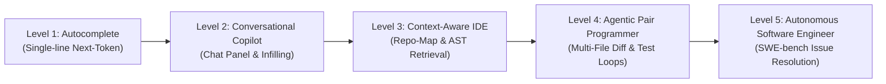
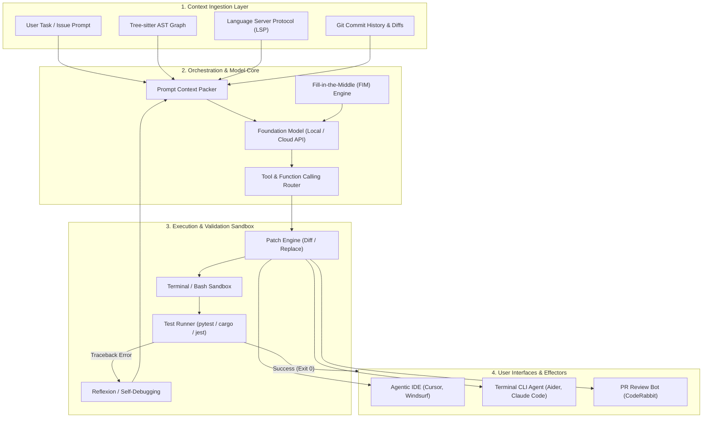
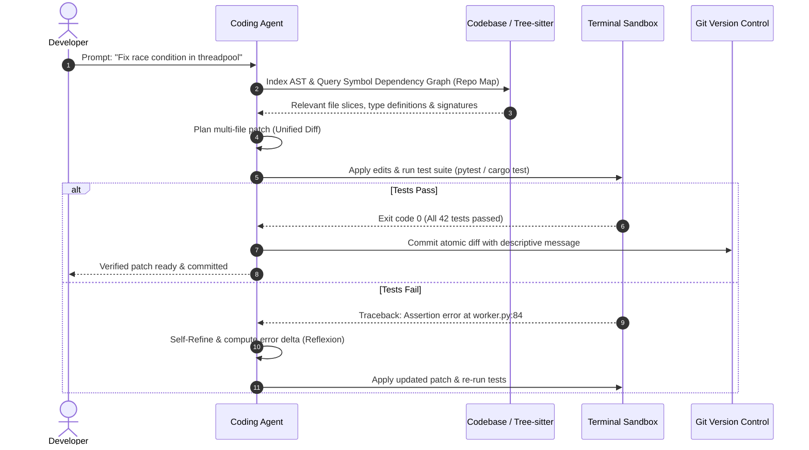
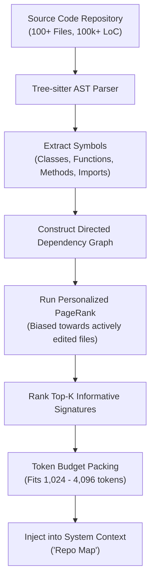
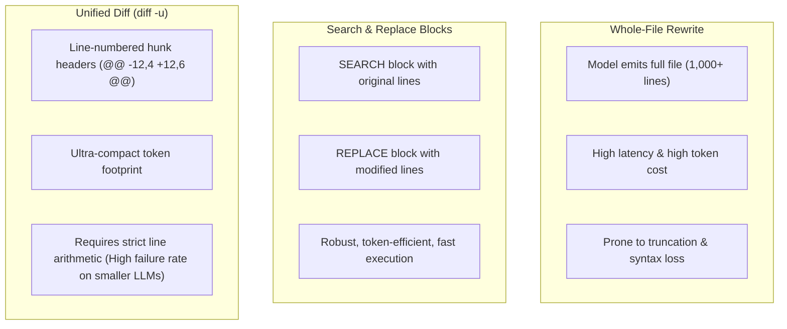

# Awesome AI Coding Tools [](https://awesome.re) [](CONTRIBUTING.md) [](https://opensource.org/licenses/MIT)

> A curated collection of state-of-the-art AI coding assistants, terminal agents, autonomous software engineering architectures, local code foundation models, and seminal research papers bridging academia and industry.

---

## 📑 Contents

- [Architectural Paradigm & Taxonomy](#-architectural-paradigm--taxonomy)
- [Visual Workflows & System Architecture](#-visual-workflows--system-architecture)
- [Agentic IDEs & Editors](#-agentic-ides--editors)
- [Terminal & CLI Coding Agents](#-terminal--cli-coding-agents)
- [Open-Source Copilots & Extensions](#-open-source-copilots--extensions)
- [Autonomous Software Engineers](#-autonomous-software-engineers)
- [Local & Open-Weight Coding Models](#-local--open-weight-coding-models)
- [Automated Code Review & Security](#-automated-code-review--security)
- [Automated Testing & QA](#-automated-testing--qa)
- [Architecture & Documentation Generators](#-architecture--documentation-generators)
- [Foundational Papers & Academic Literature](#-foundational-papers--academic-literature)
- [Benchmark Leaderboard (SWE-bench & HumanEval)](#-benchmark-leaderboard)
- [Under the Hood: Deep Technical Analysis](#-under-the-hood-deep-technical-analysis)
- [Local Offline Developer Recipe](#-local-offline-developer-recipe)
- [Comprehensive Feature Matrix](#-comprehensive-feature-matrix)
- [BibTeX Citations](#-bibtex-citations)
- [Contributing](#-contributing)

---

## 🏗 Architectural Paradigm & Taxonomy

Modern AI-augmented software engineering has evolved across five distinct autonomy tiers:



### Full System Taxonomy of AI Coding Engines



---

## 🔄 Visual Workflows & System Architecture

### 1. The Autonomous Agent Execution Sequence Loop

Modern coding agents (e.g., Aider, SWE-agent, Cursor Composer) operate as closed-loop feedback controllers rather than passive generative models:



### 2. Repository-Level Context Retrieval via AST & PageRank

How agents assemble large codebases into a constrained context window without naive context dumping:



### 3. Patch Editing Paradigms Comparison



---

## 💻 Agentic IDEs & Editors

Full-featured development environments built natively around agentic pair programming and multi-file code editing.

- [Cursor](https://www.cursor.com/) — AI-native fork of VS Code featuring instant codebase indexing, multi-file edits (Composer), semantic search, and automated terminal error fixing.
- [Windsurf](https://codeium.com/windsurf) — Next-generation agentic IDE by Codeium featuring "Flows" that track real-time developer context and synchronized multi-step edits.
- [Zed](https://zed.dev/) — High-performance, GPU-accelerated code editor written in Rust with deep model integration, low input latency, and concurrent assistant panels.
- [PearAI](https://trypear.ai/) — Open-source alternative to Cursor built on VS Code with transparent model routing and customizable backends.

---

## ⚡ Terminal & CLI Coding Agents

Command-line power tools that operate directly inside your terminal, managing git commits and automated terminal feedback.

- [Aider](https://github.com/paul-gauthier/aider) — Command-line AI pair programmer that parses your repository into a Tree-sitter map, edits multiple files, runs lint/test commands, and automatically commits atomic git diffs.
- [Claude Code](https://docs.anthropic.com/en/docs/agents-and-tools/claude-code/overview) — High-agency CLI research tool capable of navigating large code repositories, running shell commands, and managing complex multi-file refactors.
- [Cline](https://github.com/cline/cline) — Autonomous coding agent extension for VS Code that executes terminal commands, inspects local browser previews, and requests human-in-the-loop permission.
- [Mentat](https://github.com/AbanteAI/mentat) — Open-source AI tool capable of coordinating complex git workflows directly in the terminal with repo-wide context.

---

## 🔌 Open-Source Copilots & Extensions

Pluggable extensions compatible with standard editors (VS Code, Neovim, JetBrains) allowing custom local and remote model backends.

- [Continue.dev](https://github.com/continuedev/continue) — The leading open-source AI code assistant for VS Code and JetBrains; supports local models (Ollama, LM Studio) and cloud APIs with custom slash commands.
- [Avante.nvim](https://github.com/yetone/avante.nvim) — Neovim plugin designed to emulate Cursor AI's multi-file editing capabilities natively in Lua.
- [Codeium](https://codeium.com/) — Free AI code completion and chat extension for 40+ IDEs with enterprise self-hosting options.
- [Tabby](https://github.com/TabbyML/tabby) — Self-hosted AI coding assistant server; an open-source alternative to GitHub Copilot with full data privacy.

---

## 🤖 Autonomous Software Engineers

Full-loop autonomous agents that triage GitHub issues, implement features, and run verification test suites independently.

- [OpenHands (formerly OpenDevin)](https://github.com/All-Hands-AI/OpenHands) — Autonomous software development agent capable of writing code, browsing the web, and running dockerized environments.
- [SWE-agent](https://github.com/princeton-nlp/SWE-agent) — Open-source agent developed by Princeton that resolves real GitHub issues on the SWE-bench benchmark using an Agent-Computer Interface (ACI).
- [Devika](https://github.com/stitionai/devika) — Agentic open-source software engineer capable of breaking down user goals into multi-stage tasks and executing web research.

---

## 🧠 Local & Open-Weight Coding Models

Top-tier open weights you can run locally or deploy on private infrastructure to keep proprietary code completely private.

- [Qwen2.5-Coder](https://github.com/QwenLM/Qwen2.5-Coder) — Leading open-source coding foundation model series (0.5B to 32B) competitive with leading closed models across code generation, completion, and multi-file reasoning.
- [DeepSeek-Coder-V2](https://github.com/deepseek-ai/DeepSeek-Coder-V2) — Mixture-of-Experts code language model with 128k context length supporting 338 programming languages.
- [StarCoder 2](https://github.com/bigcode-project/starcoder2) — Open, transparently trained code models (3B, 7B, 15B) curated by BigCode under permissive licenses.
- [Codestral](https://mistral.ai/news/codestral/) — Mistral AI’s open-weight model specialized in code completion and fill-in-the-middle tasks with an 80-language vocabulary.

---

## 🛡️ Automated Code Review & Security

Review bots that inspect pull requests, catch subtle concurrency bugs, and enforce architectural guidelines.

- [CodeRabbit](https://coderabbit.ai/) — AI-driven pull request reviewer providing line-by-line feedback, sequence diagrams, and security vulnerability checks.
- [Qodo (CodiumAI)](https://www.qodo.ai/) — Comprehensive code integrity platform analyzing PRs, writing regression tests, and enforcing code standards.
- [Semgrep Assistant](https://semgrep.dev/) — Combines deterministic static analysis (AST rules) with LLM explanations to eliminate false-positive security findings.

---

## 🧪 Automated Testing & QA

Tools that automatically write edge cases, integration tests, and unit tests to push test coverage up to 90%+.

- [Cover-Agent](https://github.com/Codium-ai/cover-agent) — Open-source generative testing tool that iteratively generates unit tests until target coverage is met.
- [Keploy](https://github.com/keploy/keploy) — Open-source zero-code test generator that captures real network calls and creates automated regression test suites.
- [Mutmut](https://github.com/boxed/mutmut) — Python mutation testing system that tests the resilience of your test suites against simulated faults.

---

## 📐 Architecture & Documentation Generators

Keep system design documents, API specifications, and architecture diagrams in sync with codebases.

- [Mintlify](https://mintlify.com/) — Automated documentation generator that reads codebases and outputs developer docs.
- [Swimm](https://swimm.io/) — Code-coupled documentation platform that uses AI to automatically update developer walkthroughs when code changes.
- [Eraser.io / DiagramGPT](https://www.eraser.io/) — Turns plain code or markdown architecture descriptions into clean flowcharts and cloud infrastructure diagrams.

---

## 📚 Foundational Papers & Academic Literature

A curated bibliography of seminal academic publications establishing the theory, benchmarks, and architectures for AI-assisted programming:

### 1. Benchmarks & Real-World Evaluation
- **SWE-bench: Can Language Models Resolve Real-World GitHub Issues?** (Jimenez et al., *ICLR 2024*)  
  *Introduced the standard benchmark evaluating LLMs on 2,294 real-world GitHub issues across popular Python repositories.*  
  [[ArXiv](https://arxiv.org/abs/2310.06770)] | [[Code](https://github.com/princeton-nlp/SWE-bench)]
- **Evaluating Large Language Models Trained on Code** (Chen et al., *OpenAI Technical Report 2021*)  
  *Introduced Codex and the **HumanEval** benchmark, defining functional correctness via automated unit tests ($pass@k$).*  
  [[ArXiv](https://arxiv.org/abs/2107.03374)]
- **Program Synthesis with Large Language Models** (Austin et al., *2021*)  
  *Formulated the **MBPP** (Mostly Basic Python Problems) dataset for programming evaluation.*  
  [[ArXiv](https://arxiv.org/abs/2108.07732)]
- **Can It Edit? Evaluating the Ability of Large Language Models to Solve Code Editing Tasks** (Cassano et al., *2024*)  
  *Evaluated LLMs on diff-based code editing vs. scratch code generation, revealing that editing requires distinct training signals.*  
  [[ArXiv](https://arxiv.org/abs/2406.01254)]

### 2. Repository-Level Context & Retrieval
- **RepoCoder: Repository-Level Code Completion Through Iterative Retrieval and Generation** (Zhang et al., *EMNLP 2023*)  
  *Proposed an iterative retrieval-generation framework combining similarity retrieval with generation-conditioned queries to utilize repo-wide context.*  
  [[ArXiv](https://arxiv.org/abs/2303.12570)] | [[Code](https://github.com/microsoft/RepoCoder)]
- **CrossCodeEval: A Diverse and Multilingual Benchmark for Cross-File Code Completion** (Ding et al., *NeurIPS 2023*)  
  *Standardized cross-file dependency benchmarking across Python, Java, C#, and TypeScript.*  
  [[ArXiv](https://arxiv.org/abs/2310.19379)]

### 3. Agentic Loops & Self-Correction
- **SWE-agent: Agent-Computer Interfaces Enable Automated Software Engineering** (Yang et al., *2024*)  
  *Designed the Agent-Computer Interface (ACI) giving LLMs specialized file-viewing, directory-searching, and test execution tools.*  
  [[ArXiv](https://arxiv.org/abs/2405.15793)] | [[Code](https://github.com/princeton-nlp/SWE-agent)]
- **InterCode: Standardizing and Benchmarking Interactive Coding with Execution Feedback** (Yang et al., *ICML 2023*)  
  *Formalized interactive coding as a Reinforcement Learning POMDP environment.*  
  [[ArXiv](https://arxiv.org/abs/2306.14898)]
- **Self-Debugging: Teaching Language Models to Debug and Self-Refine** (Chen et al., *ICML 2023*)  
  *Demonstrated that models improve accuracy through runtime execution feedback and explanation generation without extra training data.*  
  [[ArXiv](https://arxiv.org/abs/2304.05128)]

### 4. Open Foundation Models for Code
- **Qwen2.5-Coder Technical Report** (Hui et al., *2024*)  
  *Detailed the architecture, synthetic data pipelines, and multi-stage pre-training of the 0.5B--32B code models.*  
  [[ArXiv](https://arxiv.org/abs/2409.12186)]
- **DeepSeek-Coder: When the Large Language Model Meets Programming** (Guo et al., *2024*)  
  *Pre-trained on 2 trillion code tokens using Fill-in-the-Middle (FIM) and project-level context.*  
  [[ArXiv](https://arxiv.org/abs/2401.14196)]
- **CodeLlama: Open Foundation Models for Code** (Rozière et al., *2023*)  
  *Specialized Llama 2 with infilling capability and long-context (100k) adaptation.*  
  [[ArXiv](https://arxiv.org/abs/2308.12950)]

### 5. Empirical Developer Productivity Studies
- **The Impact of AI on Developer Productivity: Evidence from GitHub Copilot** (Peng et al., *2023*)  
  *Controlled trial showing developers completed tasks 55.8% faster with AI assistance.*  
  [[ArXiv](https://arxiv.org/abs/2302.06590)]

---

## 🏆 Benchmark Leaderboard

Summary of state-of-the-art results on the standardized **SWE-bench Verified** benchmark (500 curated real-world GitHub issues):

| Rank | Agent / System Architecture | Base Model | Resolved % ($pass@1$) | Verification Loop | Primary Reference |
| :---: | :--- | :--- | :---: | :---: | :--- |
| **1** | OpenHands + CodeAct | Frontier Model | **53.0%** | Docker Test Sandbox | Wang et al. (2024) |
| **2** | SWE-agent + ACI | Frontier Model | **43.2%** | Containerized ACI | Yang et al. (2024) |
| **3** | Aider + Architect Loop | Qwen2.5-Coder-32B | **38.4%** | Terminal Pytest Loop | Gauthier (2024) |
| **4** | SWE-agent | DeepSeek-Coder-V2 | **35.6%** | Execution Feedback | Yang et al. (2024) |
| **5** | Baseline Zero-Shot Prompt | Dense 70B Model | **12.5%** | None (Single-Turn) | Jimenez et al. (2024) |

---

## 🔍 Under the Hood: Deep Technical Analysis

### 1. Tree-sitter Repository Maps
Rather than naively loading entire files into the context window, tools like **Aider** construct a condensed **Repo Map** using Tree-sitter:
- Extracts definitions (classes, functions, method signatures, call hierarchies).
- Uses PageRank over the dependency graph to rank which symbols are most relevant to the current user prompt.
- Sends a concise map (typically 1k--2k tokens) allowing the model to reason about cross-file dependencies without context bloat.

### 2. Patch Editing Strategies
When modifying code, agents choose between three representations:
- **Whole File Rewrite:** High accuracy for small files; extremely slow and expensive on large files.
- **Search & Replace Blocks:** Fast and reliable; requires the model to reproduce exact existing lines.
- **Unified Diff Formats (`diff -u`):** Compact; requires strict line-number adherence, which can fail with non-specialized models.

---

## 🚀 Local Offline Developer Recipe

Want to run an agentic coding assistant with **100% data privacy** and zero API costs? Here is the standard local stack:

```bash
# 1. Pull the top-tier local coding model using Ollama
ollama run qwen2.5-coder:14b

# 2. Install Aider
pip install aider-chat

# 3. Launch Aider in your git repo with local Ollama
cd /path/to/your/project
aider --model ollama/qwen2.5-coder:14b
```

Alternatively, configure [Continue.dev](https://github.com/continuedev/continue) in VS Code to point to `http://localhost:11434` for a native IDE interface.

---

## ⚖️ Comprehensive Feature Matrix

| Tool / Project | Interface Type | Multi-File Editing | Open Source? | Local Models (Ollama)? | Autonomous Test Loop | Context Strategy |
| :--- | :--- | :---: | :---: | :---: | :---: | :--- |
| **Cursor** | Standalone IDE | ✅ (Composer) | ❌ | Partial | ❌ (Manual Run) | Semantic RAG + Index |
| **Windsurf** | Standalone IDE | ✅ (Cascade) | ❌ | ❌ | ❌ (Manual Run) | Real-Time Flows |
| **Aider** | CLI / Terminal | ✅ | ✅ | ✅ | ✅ (Automatic) | Tree-sitter Repo Map |
| **Cline** | VS Code Ext. | ✅ | ✅ | ✅ | ✅ (Terminal Tool) | Tool-based File Read |
| **Continue.dev** | VS Code / JetBrains | ✅ | ✅ | ✅ | ❌ | Custom Slash Commands |
| **OpenHands** | Web UI / Docker | ✅ | ✅ | ✅ | ✅ (Docker Sandbox) | Full Event Loop |
| **SWE-agent** | CLI / Benchmark | ✅ | ✅ | ✅ | ✅ (Containerized) | Agent-Computer Interface |

---

## 📖 BibTeX Citations

If you cite or benchmark these foundational tools and literature, use the following entries:

```bibtex
@inproceedings{jimenez2024swebench,
  title     = {SWE-bench: Can Language Models Resolve Real-World GitHub Issues?},
  author    = {Jimenez, Carlos E. and Yang, John and Wettig, Alexander and Yao, Shunyu and Pei, Kexin and Press, Ofir and Narasimhan, Karthik},
  booktitle = {International Conference on Learning Representations (ICLR)},
  year      = {2024}
}

@article{chen2021codex,
  title     = {Evaluating Large Language Models Trained on Code},
  author    = {Chen, Mark and Tworek, Jerry and Jun, Heewoo and Yuan, Qiming and de Oliveira Pinto, Henrique Ponde and Kaplan, Jared and Edwards, Harri and Burda, Yuri and Joseph, Nicholas and Brockman, Greg and others},
  journal   = {arXiv preprint arXiv:2107.03374},
  year      = {2021}
}

@inproceedings{zhang2023repocoder,
  title     = {RepoCoder: Repository-Level Code Completion Through Iterative Retrieval and Generation},
  author    = {Zhang, Fengji and Chen, Bei and Zhang, Yue and Liu, Jacky and Lou, Jian-Guang},
  booktitle = {Empirical Methods in Natural Language Processing (EMNLP)},
  year      = {2023}
}

@article{yang2024sweagent,
  title     = {SWE-agent: Agent-Computer Interfaces Enable Automated Software Engineering},
  author    = {Yang, John and Jimenez, Carlos E. and Wettig, Alexander and Lieret, Kilian and Yao, Shunyu and Narasimhan, Karthik and Press, Ofir},
  journal   = {arXiv preprint arXiv:2405.15793},
  year      = {2024}
}

@article{hui2024qwen25coder,
  title     = {Qwen2.5-Coder Technical Report},
  author    = {Hui, Binyuan and Yang, Jian and Cui, Zeyu and Yang, Jiaxi and Liu, Dayiheng and Zhang, Lei and Liu, Tianyu and Zhang, Baosong and Yu, Bowen and Dang, Kai and others},
  journal   = {arXiv preprint arXiv:2409.12186},
  year      = {2024}
}

@misc{sajjadi2026awesomecoding,
  title        = {Awesome AI Coding Tools: A Curated Taxonomy of Agents, Architectures, and Research},
  author       = {Sajjadi, Mahmoud},
  year         = {2026},
  howpublished = {\url{https://github.com/mahmoudsajjadi/awesome-ai-coding-tools}}
}
```

---

## 🤝 Contributing

We welcome community contributions! Please review [CONTRIBUTING.md](CONTRIBUTING.md) to propose additions or modifications.

---

## 📄 License

This repository is distributed under the [MIT License](LICENSE).
